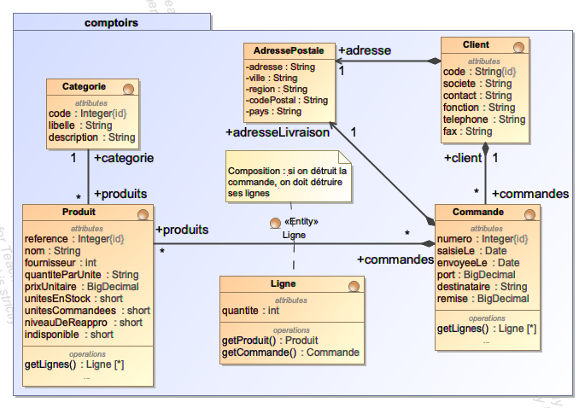

# Conception et test d'un "Service métier"

On se propose de développer le service métier permettant de gérer les commandes pour un site de vente
en ligne.
Les spécifications précises du service à développer sont explicitées dans le javadoc des méthodes
de la classe [CommandeService](./src/main/java/comptoirs/service/CommandeService.java). Les [tests unitaires](./src/test/java/comptoirs/service) fournis vérifient que les règles métier sont bien respectées.

## Modèle conceptuel de données

L'application utlise une base de données relationnelle dont le modèle conceptuel est le suivant :

Notes :

- Dans la table `Produit`, le champ `unitesCommandées` représente le nombre d'unités "en commande", c'est à dire présentes dans des commandes qui n'ont pas encore été envoyées.
- Dans la table `Produit`, le champ `unitesEnStock` représente le nombre d'unités "en stock". Contrainte métier : la quantité en stock ne doit jamais être inférieure à la quantité en commande.
- Dans la table `Commande`, le champ `envoyeele` indique si la commande a été envoyée ou non (null si pas envoyée). Quand une commande est envoyée, la date d'envoi est enregistrée dans ce champ, les produits commandés ne sont plus "en stock" ni "en commande".

## TODO

1. dans [`ClientRepository`](./src/main/java/comptoirs/dao/ClientRepository.java), trouver la requête qui calcule le nombre d'articles commandés pour un client dont le code est passé en paramètre.
2. Implementer les méthodes de la classe [`CommandeService`](./src/main/java/comptoirs/service/CommandeService.java) de manière à ce que les tests unitaires passent tous.
